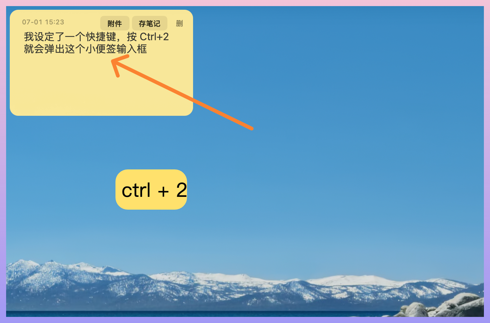
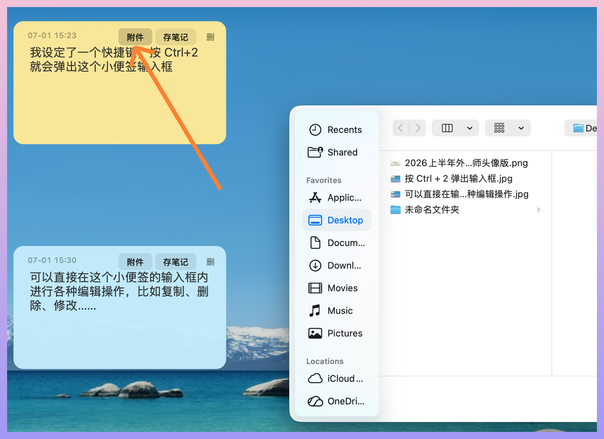
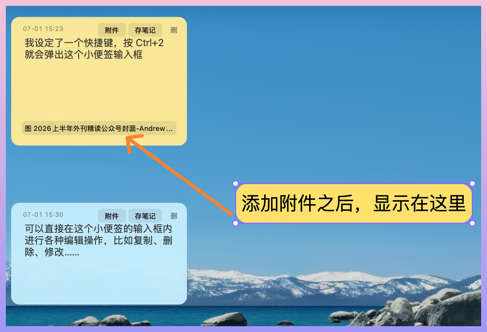
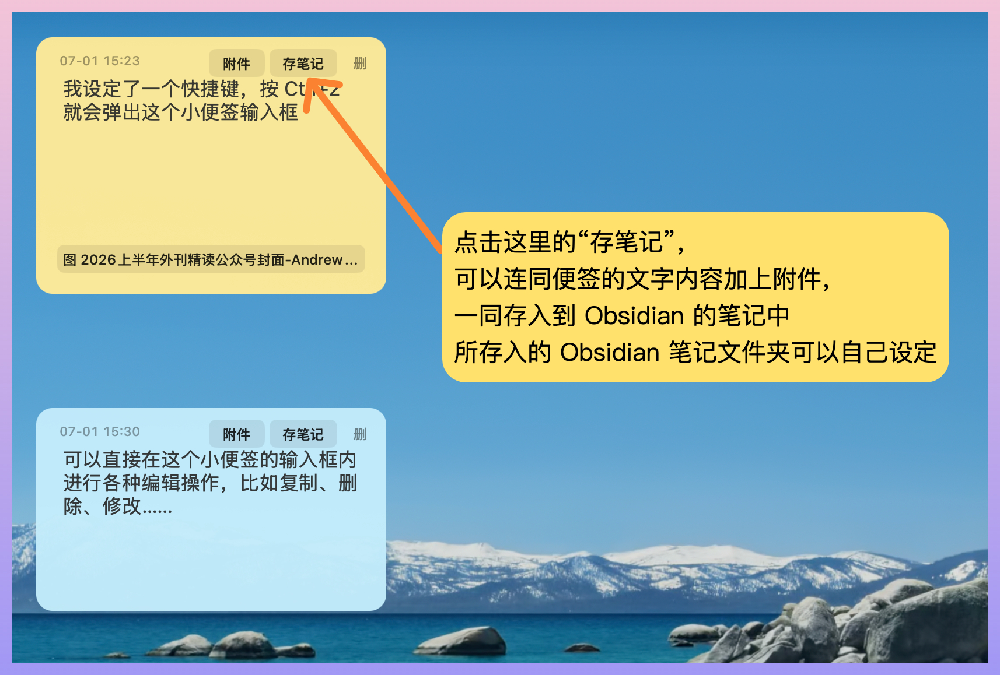
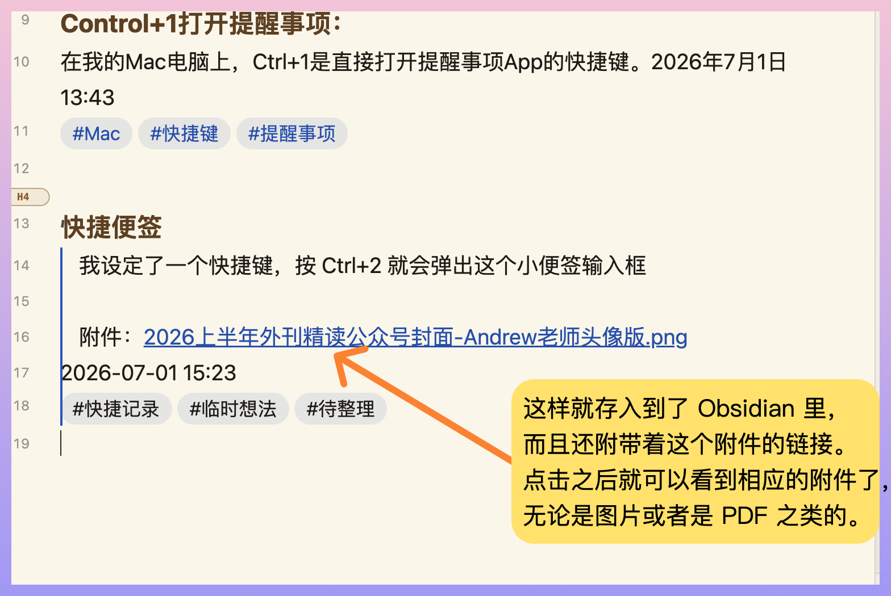
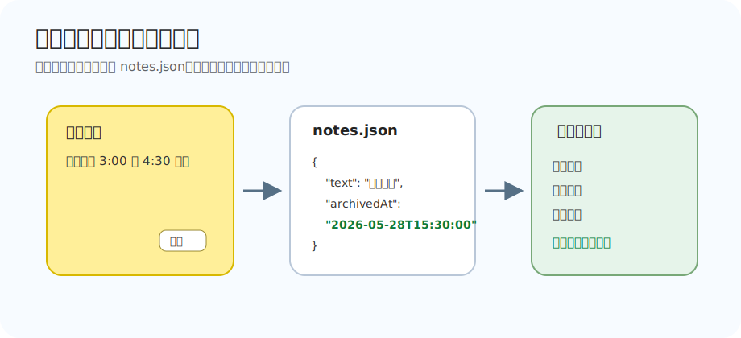

# 小便签 xiaobianqian

一个极简 macOS 桌面便签工具：把临时想法、待办、提醒贴到桌面左侧，处理完就删除，值得保留的内容可以一键归档到 Obsidian。



## 它能做什么

- 彩色桌面便签，自动排列在桌面左侧。
- 按 `Ctrl+2` 可直接新建一张空白便签，并自动把光标放进正文输入区。
- 便签正文是原生可编辑文本框，支持输入法、语音输入、复制、粘贴、删除、撤销和修改。
- 命令行快速添加、查看、清空、恢复。
- 支持图片、PDF、Markdown 等附件。
- 单条便签可删除。
- 可选：点击便签上的 `存笔记`，把内容归档到 Obsidian。
- 已归档状态会持久保存：点过 `存笔记` 后会显示 `已存`，之后新增或删除其他便签也不会变回未归档状态。
- 删除最后一张便签后，桌面窗口会自动隐藏，程序仍继续运行，方便下次用 `Ctrl+2` 新建。
- 可作为 Codex skill 使用，在 Codex 里说“小便签 今天记得……”即可创建桌面便签。

## 功能预览

### 1. 按 Ctrl+2 新建便签


### 2. 在便签里直接编辑


### 3. 添加附件



### 4. 附件显示在便签里



### 5. 一键存入 Obsidian



### 6. Obsidian 归档效果



## 系统要求

- macOS。
- 系统自带 Swift 编译器。一般安装过 Xcode Command Line Tools 就有。
- Python 3。macOS 通常自带 `/usr/bin/python3`。
- 如果要使用 Obsidian 归档功能，需要本机已安装并使用 Obsidian。

第一次运行时，脚本会自动用 `swiftc` 编译桌面程序。

桌面程序会以真正的 macOS `.app` 方式在后台运行。启动成功后可以关闭终端窗口，便签仍会继续显示在桌面上。

## 下载方式

### 方式一：用 git 下载，推荐

打开 macOS 的“终端”，运行：

```bash
git clone https://github.com/Andrewshilexiaoxi/xiaobianqian.git
cd xiaobianqian
```

之后所有命令都在这个 `xiaobianqian` 文件夹里运行。

### 方式二：下载 ZIP

1. 打开本仓库页面：<https://github.com/Andrewshilexiaoxi/xiaobianqian>
2. 点击绿色 `Code` 按钮。
3. 点击 `Download ZIP`。
4. 解压 ZIP 文件。
5. 在终端进入解压后的文件夹，例如：

```bash
cd ~/Downloads/xiaobianqian-main
```

## 30 秒快速开始

```bash
./scripts/smallnote add "晚上记得买水"
./scripts/smallnote open
```

运行后，桌面左侧会出现一张彩色便签。

这时你可以关闭终端，小便签不会跟着关闭。

桌面程序保持打开后，也可以随时按 `Ctrl+2` 新建一张空白便签，然后直接输入内容。

再添加一条：

```bash
./scripts/smallnote add "周六下午 3:00 到 4:30 上课"
```

带附件添加：

```bash
./scripts/smallnote add "这份 PDF 晚上看" -- "/path/to/file.pdf"
```

## 常用命令

| 命令 | 作用 |
| --- | --- |
| `./scripts/smallnote add "内容"` | 新增一条便签 |
| `./scripts/smallnote add "内容" --title "标题" --tags "#标签1 #标签2 #标签3"` | 新增带标题和标签的便签，归档时会直接使用 |
| `./scripts/smallnote add "内容" -- "/path/to/file.pdf"` | 新增带附件的便签 |
| `./scripts/smallnote list` | 查看当前便签列表 |
| `./scripts/smallnote open` | 打开或刷新桌面便签程序 |
| `./scripts/smallnote stop` | 关闭桌面便签程序 |
| `./scripts/smallnote clear` | 清空当前便签 |
| `./scripts/smallnote restore` | 恢复最近一次清空或删除备份 |
| `./scripts/smallnote archive NOTE_ID` | 手动把指定便签归档到 Obsidian |

## 数据保存在哪里

默认数据目录：

```text
~/Library/Application Support/xiaobianqian
```

里面常见文件：

```text
notes.json                 当前便签
deleted.json               最近删除/清空的备份
attachments/               便签附件缓存
```

你也可以自定义数据目录：

```bash
export XIAOBIANQIAN_DATA_DIR="$HOME/Documents/xiaobianqian-data"
```

如果你想每次打开终端都自动使用这个目录，可以把上面这一行加入 `~/.zshrc`。

## Obsidian 归档

如果想使用便签右上角的 `存笔记` 按钮，需要先告诉小便签你的 Obsidian 仓库在哪里，以及要写入哪一篇笔记。

```bash
export XIAOBIANQIAN_OBSIDIAN_VAULT="$HOME/ObsidianVault"
export XIAOBIANQIAN_OBSIDIAN_NOTE="临时存放/01语音笔记.md"
```

把 `$HOME/ObsidianVault` 换成你自己的 Obsidian 仓库路径。

例如你的 Obsidian 仓库在 iCloud 里，可以写成类似这样：

```bash
export XIAOBIANQIAN_OBSIDIAN_VAULT="$HOME/Library/Mobile Documents/iCloud~md~obsidian/Documents/你的仓库名"
export XIAOBIANQIAN_OBSIDIAN_NOTE="临时存放/01语音笔记.md"
```

建议把这两行也加入 `~/.zshrc`，否则新开一个终端后需要重新设置。

### 归档后写成什么样

点击 `存笔记` 后，会在目标 Obsidian 笔记末尾追加：

```markdown
#### 自动标题
> 便签正文
2026-05-28 15:30
#标签1 #标签2 #标签3
```

如果创建便签时传入了 `--title` 和 `--tags`，归档会直接使用这两个字段；否则会使用默认标题，标签行可以留空。

如果便签带附件，附件会复制到 Obsidian 仓库里：

```text
资料库/附件/小便签/NOTE_ID/
```

并在笔记中写成 Obsidian 可点击的 wikilink：

```markdown
> 附件：[[资料库/附件/小便签/NOTE_ID/file.pdf|file.pdf]]
```

## 已存状态不会丢失



从这个版本开始，小便签会把归档状态写进 `notes.json` 的 `archivedAt` 字段。

这意味着：

- 点击 `存笔记` 成功后，按钮会变成 `已存`。
- 这条便签之后不会重复写入 Obsidian。
- 新增其他便签后，它仍然显示 `已存`。
- 删除其他便签后，它仍然显示 `已存`。
- 重新打开桌面便签程序后，它仍然显示 `已存`。

`notes.json` 中大致长这样：

```json
{
  "id": "note-id",
  "text": "周六下午 3:00 到 4:30 上课",
  "color": 1,
  "createdAt": "2026-05-28T00:16:24Z",
  "archivedAt": "2026-05-28T15:30:00+08:00",
  "attachments": [],
  "title": "周六课程提醒",
  "tags": "#课程 #提醒 #周末安排"
}
```

如果 `archivedAt` 是 `null` 或不存在，表示还没有归档。

## 作为 Codex Skill 使用

这个仓库包含一个 `SKILL.md`，可以放到 Codex skills 目录里使用。

在仓库根目录运行：

```bash
mkdir -p ~/.codex/skills
cp -R . ~/.codex/skills/xiaobianqian
```

之后在 Codex 里说：

```text
小便签 晚上 8 点记得看快递
```

Codex 会调用：

```bash
scripts/smallnote add "晚上 8 点记得看快递"
```

从而创建桌面便签。

## 推荐的完整配置步骤

1. 下载仓库。
2. 进入仓库目录。
3. 运行 `./scripts/smallnote add "第一条小便签"`。
4. 运行 `./scripts/smallnote open`，确认桌面左侧能看到便签。
5. 如果需要 Obsidian 归档，设置 `XIAOBIANQIAN_OBSIDIAN_VAULT` 和 `XIAOBIANQIAN_OBSIDIAN_NOTE`。
6. 新增一条测试便签，点击 `存笔记`。
7. 打开 Obsidian 目标笔记，确认内容已经追加。
8. 再新增或删除一条其他便签，确认刚才那条仍然显示 `已存`。

## 常见问题

### 运行后没有看到便签

先手动打开：

```bash
./scripts/smallnote open
```

再查看当前便签：

```bash
./scripts/smallnote list
```

### 提示 Swift 编译失败

先安装 Xcode Command Line Tools：

```bash
xcode-select --install
```

安装完成后重新运行：

```bash
./scripts/smallnote open
```

### 点击存笔记没有反应

通常是没有设置 Obsidian 环境变量。先检查：

```bash
echo "$XIAOBIANQIAN_OBSIDIAN_VAULT"
echo "$XIAOBIANQIAN_OBSIDIAN_NOTE"
```

如果输出为空，需要按“Obsidian 归档”一节重新设置。

### 我可以不用 Obsidian 吗

可以。小便签的基础功能不依赖 Obsidian。只有点击 `存笔记` 或运行 `archive` 时才需要 Obsidian 配置。

### 怎么关闭桌面便签

```bash
./scripts/smallnote stop
```

平时不用为了保留便签而开着终端；只有需要新增、清空、恢复或关闭时，才需要再打开终端运行命令。

### 怎么清空

```bash
./scripts/smallnote clear
```

清空前请确认当前便签都不需要了。

## 隐私说明

小便签只读写本机文件，不上传你的便签数据。Obsidian 归档也只写入你配置的本地 vault。

## 开源说明

这是一个个人工作流里长出来的小工具，代码很轻量，适合参考、改造和二次开发。欢迎 fork 后按自己的习惯调整。
