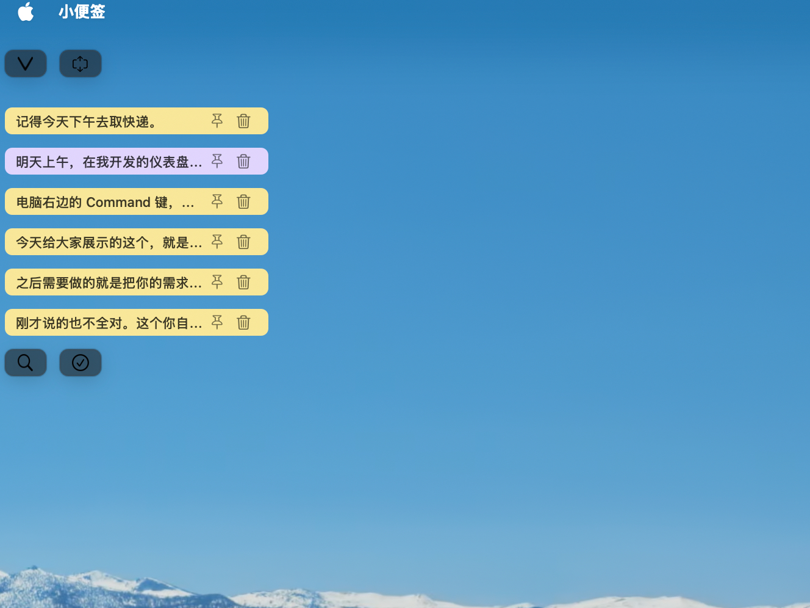
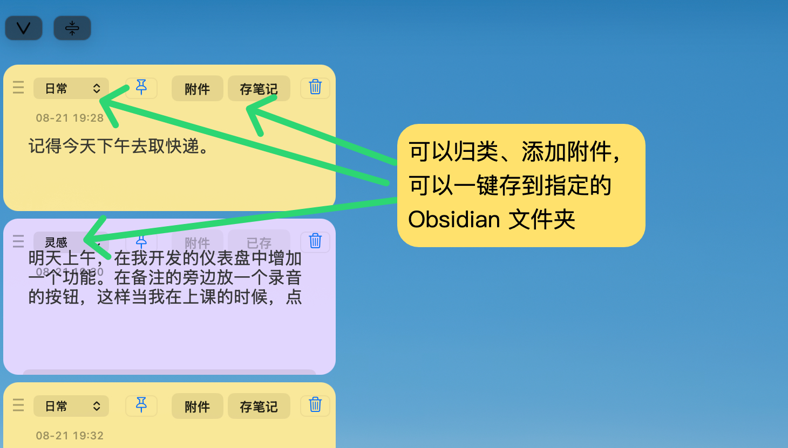

# 小便签 xiaobianqian

一个轻量的 macOS 桌面胶囊便签工具：把临时想法、待办、提醒和语音记录先放在屏幕边缘，随时可见、可编辑、可整理；值得长期保存的内容，再一键归档到 Obsidian。

当前版本的改动记录见 [CHANGELOG.md](CHANGELOG.md)。

## 最新界面

下面的截图来自当前版本，并用箭头标出了新功能入口。

### 收缩胶囊：持续可见，但不占用桌面



### 展开卡片：分类、附件、归档和删除集中在第一行



### 一键展开：同时查看多条便签的完整内容


## 功能概览

- 左侧边缘胶囊：默认收缩为窄标签，鼠标靠近或移动到屏幕左边缘时显示首行预览。
- 单条展开：点击胶囊后展开为独立可编辑卡片，其他便签会自动避让。
- 固定与排序：图钉可以让便签保持预览宽度；支持鼠标拖动和兼容的三指上下拖动。
- 五类颜色：紧急、灵感、日常、工作、其他，可在设置中指定新便签的默认分类。
- 快速输入：桌面程序运行后按 `Ctrl+2` 新建空白便签并直接聚焦正文。
- 语音输入：独立点按右侧 Command 开始/结束实时听写；可选接入 OpenLess 配置的火山引擎 ASR 与 DeepSeek 润色。
- 语音热词：在设置中的“个人词库”维护人名和专业术语，也可以使用 `smallnote hotwords`。
- 搜索与批量管理：搜索标题、正文、标签和附件名称；批量选择、全选和确认删除。
- 附件：支持图片、PDF、Markdown 和其他明确提供的文件。
- 本地持久化：正文、颜色、顺序、附件和归档状态都会保存到本机数据目录。
- Obsidian 归档：点击 `存笔记` 后将正文与附件写入指定 Obsidian 笔记，并保留 `archivedAt` 状态，避免重复归档。

核心信息流：

```text
快速输入 → 桌面胶囊暂存 → 随时查看与处理 → 删除或存入 Obsidian
```

## 系统要求

- macOS。
- Xcode Command Line Tools（提供系统 Swift 编译器）。
- Python 3（用于命令行数据和 Obsidian 归档）。
- Obsidian 为可选依赖；只有使用归档功能时才需要配置。
- 语音输入为可选功能，需要麦克风、输入监控权限和 OpenLess 中的云端服务配置。

## 30 秒开始

```bash
git clone https://github.com/Andrewshilexiaoxi/xiaobianqian.git
cd xiaobianqian

./scripts/smallnote add "晚上记得买水"
./scripts/smallnote open
```

第一次运行会自动用 `swiftc` 编译 `scripts/SmallNoteDesktop.swift`，并以 macOS `.app` 方式启动。启动后可以关闭终端窗口。

常用命令：

| 命令 | 作用 |
| --- | --- |
| `./scripts/smallnote add "内容"` | 新增便签 |
| `./scripts/smallnote add "内容" -- "/path/to/file.pdf"` | 新增带附件的便签 |
| `./scripts/smallnote open` | 打开或刷新桌面程序 |
| `./scripts/smallnote stop` | 正常关闭桌面程序并清理录音资源 |
| `./scripts/smallnote list` | 查看当前便签 |
| `./scripts/smallnote doctor` | 检查构建路径、运行进程、数据和热词 |
| `./scripts/smallnote hotwords` | 打开语音热词文件 |
| `./scripts/smallnote clear` | 清空当前便签，并保留最近批次备份 |
| `./scripts/smallnote restore` | 恢复最近一次删除或清空的批次 |
| `./scripts/smallnote archive NOTE_ID` | 手动归档指定便签 |

## 数据目录与配置

默认数据目录为：

```text
~/Library/Application Support/xiaobianqian/
```

其中包括：

```text
notes.json                 当前便签正文、颜色、顺序和归档状态
deleted.json               最近一次删除或清空的批次备份
attachments/               便签附件缓存
voice-hotwords.txt         语音热词，每行一个词
```

也可以指定自己的数据目录：

```bash
export XIAOBIANQIAN_DATA_DIR="$HOME/Documents/xiaobianqian-data"
```

不要把本机的 `notes.json`、附件目录或 API 密钥提交到 GitHub；仓库的 `.gitignore` 已排除这些运行时数据。

## Obsidian 归档

先设置 Obsidian 仓库路径和目标笔记：

```bash
export XIAOBIANQIAN_OBSIDIAN_VAULT="$HOME/ObsidianVault"
export XIAOBIANQIAN_OBSIDIAN_NOTE="临时存放/01语音笔记.md"
```

目标笔记可以是绝对路径，也可以是相对于 `XIAOBIANQIAN_OBSIDIAN_VAULT` 的路径。带附件归档时，附件会复制到：

```text
资料库/附件/小便签/NOTE_ID/
```

并写入可点击的 Obsidian wikilink。归档成功后，便签按钮会显示 `已存`，即使新增、删除其他便签或重新启动程序，也不会重复写入。

归档时的元数据整理需要 DeepSeek。可以通过环境变量临时提供密钥：

```bash
export XIAOBIANQIAN_DEEPSEEK_API_KEY="your-api-key"
```

也可以把密钥放在 macOS Keychain 中，并用以下变量指定 Keychain 服务和账户：

```bash
export XIAOBIANQIAN_DEEPSEEK_KEYCHAIN_SERVICE="com.xiaobianqian.deepseek-api"
export XIAOBIANQIAN_DEEPSEEK_KEYCHAIN_ACCOUNT="$USER"
```

密钥只在运行时读取，不写入源码、便签数据或 App Bundle。

## 语音输入

语音输入链路为：

```text
麦克风 PCM → 火山引擎实时 ASR → DeepSeek 轻度润色 → 新建语音便签
```

当前 Swift App 从 OpenLess 的 macOS Keychain 配置读取火山引擎和 DeepSeek 信息：

```text
Keychain service: com.openless.app
account: credentials.v1.chunk.0
```

语音功能不是基础文字便签的必需依赖。如果暂时没有语音云端配置，仍然可以使用 `Ctrl+2`、命令行添加、编辑、附件和搜索等功能。Obsidian 归档还需要目标 vault 配置，以及上一节所述的归档元数据配置。首次使用右侧 Command 时，macOS 可能会请求输入监控和麦克风权限。

## 作为 Codex Skill 使用

仓库包含 `SKILL.md` 和 `agents/openai.yaml`，可以复制到 Codex skills 目录：

```bash
mkdir -p ~/.codex/skills
cp -R . ~/.codex/skills/xiaobianqian
```

之后可以直接说：

```text
小便签 晚上 8 点记得看快递
```

## 开发与维护

主要文件：

- `scripts/SmallNoteDesktop.swift`：AppKit 桌面程序和胶囊交互。
- `scripts/smallnote`：编译、启动、停止、诊断、增删、恢复和归档入口。
- `SKILL.md`：Codex 小便签工作流说明。
- `docs/images/`：功能截图和流程图。

提交前建议运行：

```bash
zsh -n scripts/smallnote
swiftc -typecheck scripts/SmallNoteDesktop.swift \
  -framework AppKit \
  -framework CoreGraphics \
  -framework Carbon \
  -framework AVFAudio \
  -framework QuartzCore
```

## 隐私与安全

小便签默认只读写本机文件。云端语音和 AI 归档只有在用户主动配置服务后才会发送相应文本；密钥从环境变量或 macOS Keychain 读取，不应提交到仓库。

## 开源协议

本项目采用 [MIT License](LICENSE)。
